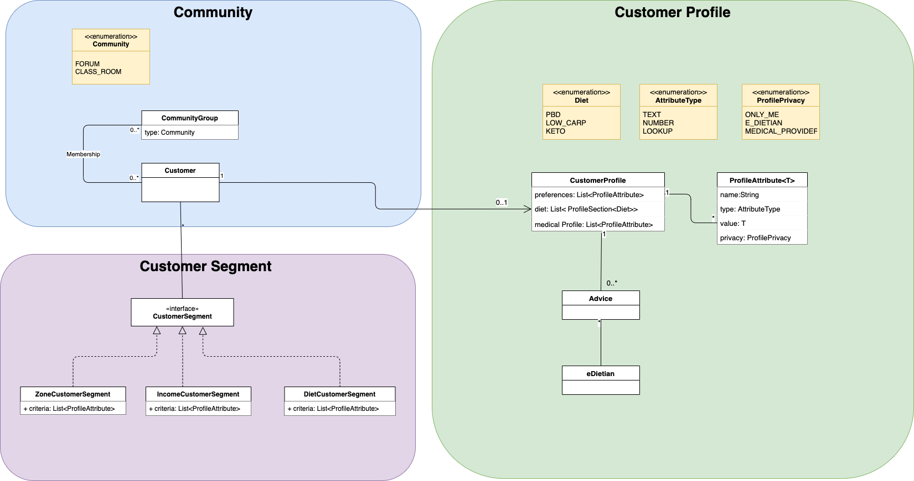
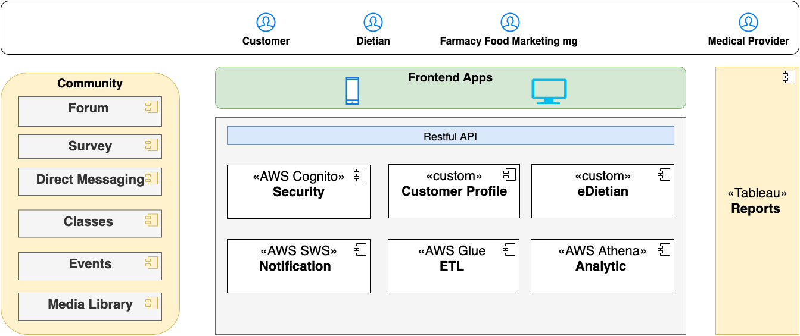
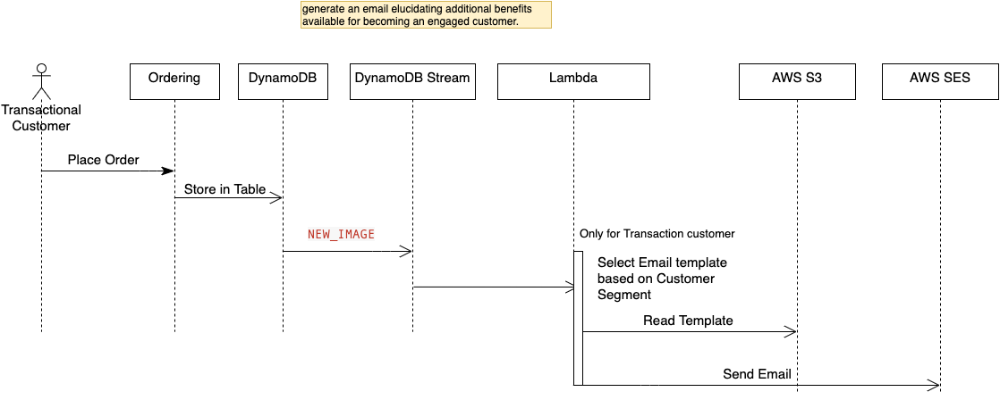
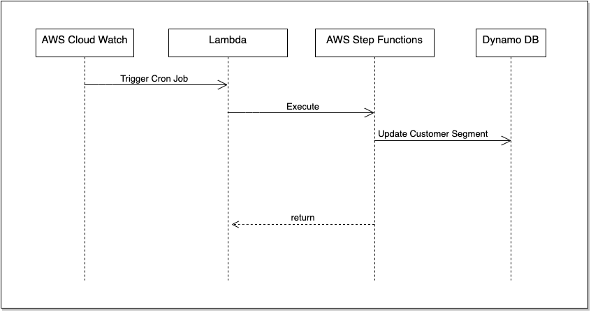
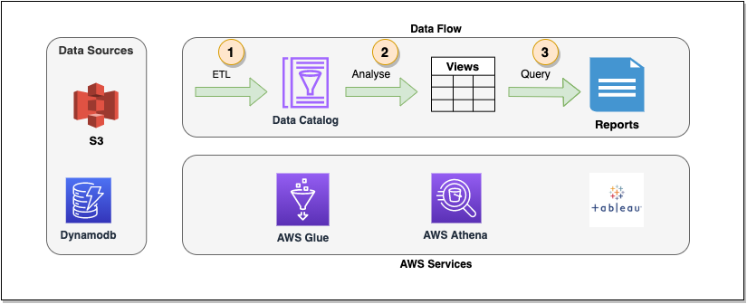

# Solution
This section describe the solution using basic diagrams with a briefing descriptions due to limited time. 

## Solution Overview

This solution focus on providing Farmacy Food with below capabilities: 

- Customer Engagment using a value-added services as well as modern community tools. 
- Data Analytics solution support rapid change in business, customer needs and market.

## Constrains

The below constraints drives solution trade-off decisions:

1. AWS is the platform for deployment as Farmacy Food Ordering System is deployed there.
2. Reduce the opertional cost by reusing existing services when possible. 
3. Budget is  limited
4. Number of customer is Hundreds, separated by distinct geographic zones.

## Data Model

This diagram describe data model.

The data model has three main domains:

1. Customer Profile which will be configured using dynamic attributes. This will support the rapid changes to the customer profile including preference, edits and medical information. 
2. Community which will track customer activites on community including membership on forums and classes. 
3. Customer Segment which will  group customers by different segment using profile attributes like geographical zone, diet, income and behaviour.

  There three domains shall be stored in a NOSQL format as structure will be changed rapidly.

## Components Diagram 

This diagram describe system components and basic functionality.

### Notification

This component will support communication with customers through different channels. It will be based on Amazon Simple Notification Service (SNS). 

This component is already part of Farmacy Farm ordering system and will be reused in this solution. More details is available in [archcolider documentation](https://github.com/ldynia/archcolider/blob/master/3.ViewsAndPerspectives/infrastructure/Infrastructure-services-and-virtual-hardware.md#amazon-simple-notification-service-sns)

### Security

This component will support Authentication and Authorization for Dietitian and Medical Provider. It will be based on AWS Cognito used for transaction customer.

This component is already part of Farmacy Farm ordering system and will be reused in this solution. More details is available in [archcolider documentation](https://github.com/ldynia/archcolider/blob/master/3.ViewsAndPerspectives/infrastructure/Authentication.md)

### Onboarding

This component will support onboarding of transactional customer on placing new order. This will be done based on customer segment. More details in Onboarding Sequence Diagram

### Cutomer Profile

This component will enable:

1.  The customer of managing her/his profile including preference, diets and medical information.
2. The customer of setting privacy per profile attribute.
3. The dietian of viewing customer profile according to privacy setting.

This component will be custom developed using serverless Architecture and will be exposed to client apps as a Restfull services.  The profile attributes configuration will be stored on AWS S3 with secured access.  

### eDietian

This component will support:

- Assigning dietian to specific customer or a customer segment. 
- Allow dietian of sending advice to customer

### Medical Survey

This component will enable:

1. Creation of medical surveys.
2. Filling medical surveys by customer 

This component will be build using a server less application from AWS market place like [serverless-survey](https://serverlessrepo.aws.amazon.com/applications/us-east-1/194383749778/serverless-survey) Survey result will be automatically stored in Dynamo DB as part of customer profile.

### Customer Segmentation 

This component will be a regular cron job to calculated customer segmantion using profile attributes like geographical zone, diet, income and behaviour.

This component will help Farmacy Family to know:

- Which Transactional Customers are not part of Farmacy Family Engaged Customer) to start the onboarding process for those customers
- Which transactional customers are Engaged Customers

### Community

This component will be build using an open source tools in order to provide forum, classes, direct messaging and media library.

An additional investigation is needed in order to select best applications considering above solution constrains. This can be covered as part of detail design decsions.

### Analytics

The analytics solution will support deifferent kind of analysis including but not limited to:

-  Geographical trend analysis to hone Farmacy Family’s ability to optimize the foods delivered to fridges **(**an additional integration point TO Farmacy Foods**)**
- Distribution and potential food waste analysis.
- Medical Report analysis and Customers Segmant analysis.

More details in Analytics Sequence Diagram.

### Reports

This component will provide below reports:

- Analytic Result to third party providers (clinics, doctors, etc) for example, regional dietary observations). 
- Medical Reports analysis Result to Medical Provider and investors.
- Distribution and potential food waste analysis result to Farmacy Foods.

It will be using tableau which is already part of Farmacy Farm ordering system and will be reused in this solution. More details is available in [archcolider documentation](https://github.com/ldynia/archcolider/blob/master/3.ViewsAndPerspectives/infrastructure/Infrastructure-services-and-virtual-hardware.md#amazon-simple-notification-service-sns)

## Sequence Diagrams

### Onboarding

This diagram describe onboarding flow which will use Dynamo DB streams in order to detect placed orders by transactional customer. Once a new order is placed then it will select matching email template according ot customer segment, enrich it and send it to the customer.

### Customer Segmentation

This diagram describe the cron job flow to calculate customer segment regualry and store it in Dynamo DB. This will be implemented using AWS Step functions which will be composed on multiple Lambda function.  AWS Step functions will provide a well-organised structure and minimise logic for each lambda functions. 

### Medical Test

This diagram describe how medical test will be filled by customer and integrated with Customer Profile in Dynamo DB.

### Analytics

This diagram describe the analytic flow starting from extract, transform and load of data using AWS Glue, going through analysis using AWS Athena queries and finally sharing result using tableau reports.

## ADRs 

### New Custom-Build Components

|                  |                                                              |
| :--------------- | ------------------------------------------------------------ |
| **Context**      | Solution will introduct new custom-build components like customer profile and customer segments.  This module can follow **modularized monolith** or being designed as **Serverless** services |
| **Decision**     | The decsion was to go for serverless due to expected changes in requirement for customer profile and customer segment. This solution is more like testing water and need to be easy to extended. |
| **Consequences** | Use AWS serverless solution including AWS API Gateway and Lambda .  **Positive**: Low deployment cost as price will be per request, easy to change and deploy as business logic is splitted into many Lambda functions   **Negatives** additional operational cost, Development team might lack experiance. |

### Data Storage

|                  |                                                              |
| :--------------- | ------------------------------------------------------------ |
| **Context**      | Solution will introduct new data like customer profile, engagment and customer segments.  This data can be stored on a relational database or use an NOSQL Dynamo DB . |
| **Decision**     | The decsion was to go for NOSQL database as data structure will changed rapidly |
| **Consequences** | Use existing Dynamo DB used for ordering event storage.  **Positive**: No operational cost, Development team has experience in Dynamo DB  |

### Customer Segmantion

|                  |                                                              |
| :--------------- | ------------------------------------------------------------ |
| **Context**      | Solution will introduct customer segmentation calculation in order to used it in onboarding and analytics. The calculation can run immediately on any changes on customer profile or just run as a batch on regular daily basis. |
| **Decision**     | The decsion was to go for running as a batch on regular daily basis but Implementation of AWS Step functions need to support working on single customer or batch. |
| **Consequences** | Configure cron job using AWS Cloud Watch  **Positive**: Less read and write operation on database  **Negative**: There will be a delay on reflecting profile changes on customer segment. |

## Risks

1. Lack of knowledge in AWS Serverless technology
2. Lack of knowledge in AWS Analytics technology

### Quality Of Service (QoS)

- Security 
- Extendability 
- Scalability 
- Performance

 

##  [<-- Back](2_Requirements.md) | [Home](README.md) | [Next -->](4_Team.md)